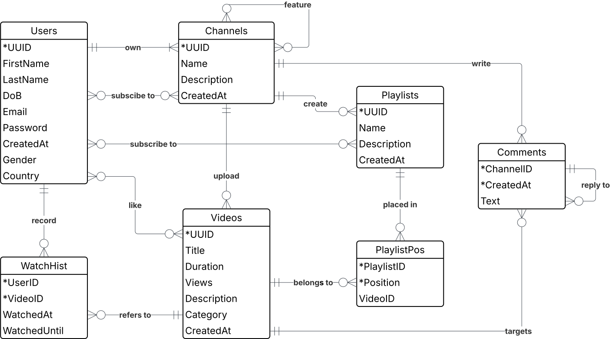

# Video streaming website

## Background story

The effect of social media companies on the moral and political landscape in
our nations is getting stronger day-by-day. A very recent example can be seen in
Nepal, where [the new leader was elected via Discord](https://www.thestreet.com/crypto/policy/nepals-gen-z-picks-new-leader-on-discord-crypto-community-in-shock).

In this example, a company within the hypothetical country of Y wants to start an
alternative to YouTube. This alternative is intended to serve the same function
while keeping the control of the platform in sovereign hands outside the reach
of foreign interests.

### Structure

The information to be recorded is similar to that of YouTube. Entities include Users,
Channels, Playlists, and Videos. Other entities which describe relations between
the entities with some extra details are comments, watch histories, and playlist
positions.

For users, it might be tempting to use emails or usernames as identities, but both
are susceptible to change, which could cause headaches as foreign keys would need
to be replaced too. Instead, [UUID](https://en.wikipedia.org/wiki/Universally_unique_identifier)s
will be used. The same goes for channels, playlists, and videos. For all of these,
UUIDs make sense as they could be used in the URLs as well.

As for the other entities, it would make more sense to have the primary key be that
of the original entity plus some identifying factor. For comments, a combination
of commenter's ID and [Unix timestamp](https://www.unixtimestamp.com/) is sufficient
(both are fixed, and limiting each commenter to 1 comment per second is reasonable).
For watch histories, the UserID and VideoID can be combined to form the primary key.
For playlist positions, a combination of PlaylistID and position# would also be sufficient.

There are many possible relations between the entities. For example, each user must
have one or more channels, while channels must belong to and only one user. The ER
model will contain a comprehensive list of the relations. Note that some advanced
relations, such as the fact that a channel-owner might allow other users to upload
to his channel, will not be included so as to limit the complexity of the project.

Keep in mind that the implementation is intended to be secure and privacy-friendly.
Passwords are only stored as hashes and view histories are only for the user's own
use and deletable on request.

## Entity Relationship Model

The assumptions about the relations were move to this section to make the project
more organised and concise. For each statement, the assumption it is based on, along
with the degree, cardinality and optional/mandatory status, are listed under it.

1. A user MUST own one or more channels. A channel MUST belong to one and only one
user.
    - For each user, a channel under their username exists by default.
    - A channel cannot exist without a user.
    - Degree in binary.
    - Cardinality is N:1.
    - Both sides are mandatory.
1. A user MAY subscribe to one or more channels. A channel MAY be subscribed to
by one or more users.
    - A user can subscribe to channels, such that new videos by the channel appear
    in their feed.
    - Degree is binary.
    - Cardinality is N:N.
    - Both sides are optional.
1. A channel MAY feature to one or more channels. A channel MAY be featured by one
or more channels.
    - A channel can feature other channels with similar features on its homepage.
    - Degree is unary.
    - Cardinality is N:N.
    - Both sides are optional.
1. A channel MAY upload one or more videos. A video MUST be owned by one and only
one channel.
    - A channel can be empty, but a video cannot exist without an uploader.
    - Degree is binary.
    - Cardinality is N:1.
    - Left side is optional, right side is mandatory.
1. A channel MAY create one or more playlists. A playlist MUST be owned by one and
only one channel.
    - A channel can be empty, but a playlist needs a channel to host it.
    - Degree is binary.
    - Cardinality is N:1.
    - Left side is optional, right side is mandatory.
1. A playlist MAY contain one or more playlist positions. A playlist position MUST
be in one and only one playlist.
    - Playlists are lists of related videos intended to played in succession. Playlist
    positions represent where each video is placed in the playlist. Empty playlists
    are allowed.
    - Degree is binary.
    - Cardinality is N:1.
    - Left side is optional, right side is mandatory.
1. A playlist position MUST belong to one and only one video. A video MAY have one
or more playlist positions.
    - A video can appear in multiple playlists, and even in multiple positions in
    the same playlist.
    - Degree is binary.
    - Cardinality is 1:N.
    - Left side is mandatory, right side is optional.
1. A user MAY subscribe to one or more playlists. A playlist MAY be subscribed to
by one or more users.
    - A user can subscribe to playlists as well, such that new videos added to the
    playlist appear in their feed.
    - Degree is binary.
    - Cardinality is N:N.
    - Both sides are optional.
1. A channel MAY make one or more comments. A comment MUST belong to one and only
one channel.
    - Comments are made by users/channels to express their views on the videos.
    Comments made by users use the default channel under their name.
    - Degree is binary.
    - Cardinality is N:1.
    - Left side is optional, right side is mandatory.
1. A comment MUST target one and only one video. A video MAY have one or more comments.
    - Comments can only be made on videos. A comment cannot target multiple videos
    at once.
    - Degree is binary.
    - Cardinality is 1:N.
    - Left side is mandatory, right side is optional.
1. A comment MAY be a reply to one and only one comment. A comment MAY have one
or more replies.
    - A comment may be a reply to another (one) comment. A comment may have many
    replies, and replies may have replies as well.
    - Degree is unary.
    - Cardinality is 1:N.
    - Both sides are optional.
1. A watch history item MUST belong to one and only one user. A user MAY have multiple
watch history items.
    - A watch history item represents a record of a user watching a video. Only
    the most recent one is kept. Watch history of a user could be empty if they
    wished to delete history.
    - Degree is binary.
    - Cardinality is 1:N.
    - Left side is mandatory, right side is optional.
1. A watch history item MUST refer to one and only one video. A video MAY be referenced
in one or more watch history items.
    - A watch history item records which video was watched. A video might not be
    recorded in any history item if all users chose to delete their histories.
    - Degree is binary.
    - Cardinality is 1:N.
    - Left side is mandatory, right side is optional.
1. A user MAY like one or more videos. A video MAY be liked by one or more users.
    - A user can like videos, and these should be recorded as users might want to
    remove the like or change it.
    - Degree is binary.
    - Cardinality is N:N.
    - Both sides are optional.

## Entity Relationship Diagram

## Relational Model

- Users(++UUID++, FirstName, LastName, DoB, Email, Password, CreatedAt, Gender, Country)
- Channels(++UUID++, Name, Description, CreatedAt, UserID(fk))
- Channel_subscriptions(++UserID++(fk), ++ChannelID++(fk))
- Channel_featured(++FeaturingChannelID++(fk), ++FeaturedChannelID++(fk))
- Playlists(++UUID++, Name, Description, CreatedAt, ChannelID(fk))
- Playlist_subscriptions(++UserID++(fk), ++PlaylistID++(fk))
- Videos(++UUID++, Title, Duration, Views, Description, Category, CreatedAt, ChannelID(fk))
- Video_likes(++UserID++(fk), ++VideoID++(fk))
- WatchHist(++UserID++(fk), ++VideoID++(fk), WatchedAt, WatchedUntil)
- PlaylistPos(++PlaylistID++(fk), ++Position++, VideoID(fk))
- Comments(++ChannelID++(fk), ++CreatedAt++, Text, ReplyToChannelID(fk), ReplyToCreatedAt(fk),
VideoID(fk))
